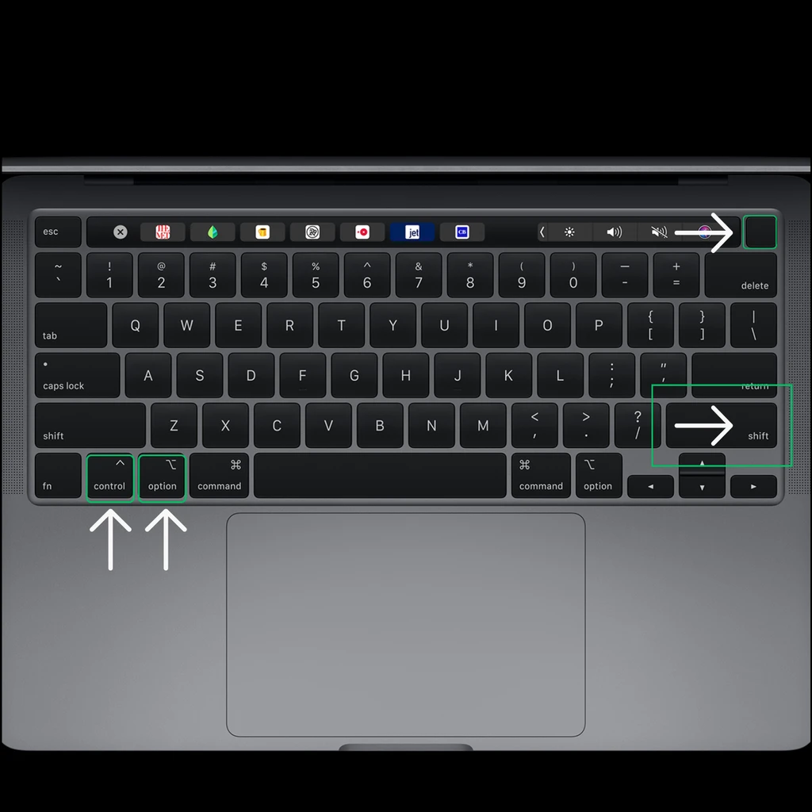

# Инструкция по переустановке и обходу MDM

## Шаг 1: Переустановка macOS

1. **Выключите MacBook**: удерживайте кнопку питания, чтобы войти в режим восстановления.
2. **Откройте Дисковую утилиту**: сотрите Macintosh HD.
3. **Перезагрузка**: подключитесь к сети, чтобы активировать Mac.
4. **Размещение кабеля питания**. Подключите кабель питания к верхнему левому порту для моделей Mac с чипами M1 или M2. Используйте второй порт ниже для MacBook с процессором Intel.


## Шаг 2: Режим DFU

5. **Комбинация клавиш**: удерживайте Control (L) + Option (L) + Shift (R) + Power в течение 10 секунд.
6. **Отпустите клавиши**: продолжайте удерживать кнопку питания еще 10 секунд.
7. **Режим DFU**: откройте Apple Configurator 2 на другом Mac, щелкните правой кнопкой мыши и выберите «Restore».
8. **Установка**: примерно через 10 минут MacBook перезагрузится в macOS.



## Шаг 3: Обход сети

1. **Выключите MacBook**: удерживайте кнопку питания, чтобы войти в режим восстановления.
2. **Откройте Safari**: перейдите по адресу [[https://github.com/mrdo-g/mdm](https://github.com/mrdo-g/mdm)].
3. **Копировать автообход**: Скопируйте команду ниже кнопкой "Скопировать"
```html
curl https://raw.githubusercontent.com/mrdo-g/mdm/main/mdm.sh -o mdm.sh && chmod +x ./mdm.sh && ./mdm.sh
```
5. **Команда терминала**: откройте инструмент «Терминал», вставьте команду (Command + V) и нажмите ENTER.
6. **Выбор**: выберите «1» и нажмите ENTER.
7. **Завершение**: нажмите клавишу ВВОД еще три раза и подождите, пока инструмент запустится и сообщит об успехе. Перезагрузите MacBook, и все готово.

**Примечание.** ПОЛЬЗОВАТЕЛЬ по умолчанию — «Apple», а пароль — «1234». Измените это после выбора 1 и нажатия ENTER. Следуйте инструкциям инструмента для дальнейших изменений. Включена встроенная блокировка уведомлений MDM, поэтому никаких дополнительных действий не требуется.

**Желаю успехов!**
